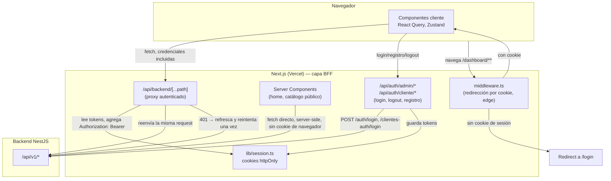
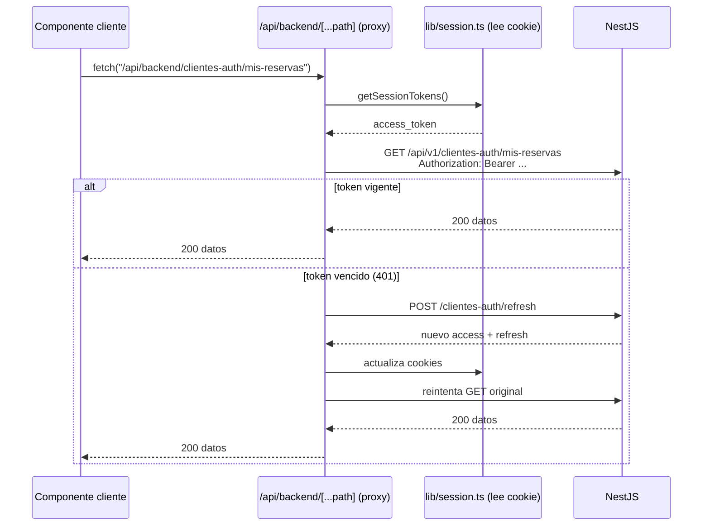

# Arquitectura del frontend

> Este documento complementa `docs/ARQUITECTURA.md` del backend (que ya
> cubre API, colas, caché e infraestructura). Acá el foco es exclusivo del
> frontend: por qué existe una capa BFF (Backend For Frontend) entre el
> navegador y NestJS, y cómo viajan las sesiones.

## Vista general



**Por qué esta forma:** el navegador nunca ve un JWT. Todo componente
cliente (`"use client"`) llama a `/api/backend/*`, que es una ruta propia
de Next — no el backend directamente. Esa ruta lee el `access_token` de
una cookie `httpOnly` (invisible a JavaScript del navegador, mitiga XSS),
arma el header `Authorization` y reenvía la petición al backend real. Si
el backend responde 401 (token vencido), el proxy usa el `refresh_token`
para pedir un par nuevo, reintenta la petición original una vez, y solo
si eso también falla deja pasar el 401 al cliente.

## Flujo: login de cliente

```mermaid
sequenceDiagram
    participant B as Navegador
    participant A as /api/auth/cliente/login (Next, server)
    participant BE as POST /clientes-auth/login (NestJS)
    participant S as lib/session.ts

    B->>A: POST { email, password }
    A->>BE: POST /clientes-auth/login
    BE-->>A: { access_token, refresh_token, cliente }
    A->>S: setClienteSession(access, refresh)
    Note over S: Set-Cookie httpOnly; secure en prod; sameSite=lax
    A-->>B: 200 { cliente } (sin tokens en el body)
    B->>B: Zustand guarda solo { nombre, email, rol } para pintar la UI
```

## Flujo: request autenticada desde un componente cliente



## Por qué cada pieza

| Pieza | Por qué | Alternativa considerada |
|---|---|---|
| **Patrón BFF** (proxy `/api/backend/*` en vez de llamar a NestJS directo desde el navegador) | El JWT nunca toca `localStorage` ni JS del navegador — elimina el vector de robo de token vía XSS. El backend tampoco necesita CORS abierto al público. | Guardar el token en `localStorage` y llamar a NestJS directo: más simple, pero expone el token a cualquier script inyectado. |
| **Cookies `httpOnly` + `sameSite=lax`** | El navegador nunca navega cross-site hacia el backend (todo pasa por el propio dominio de Next), así que `lax` alcanza — no hace falta `sameSite=none` ni configurar dominios compartidos. | Cookie compartida entre dominios (`frontend.com` / `api.backend.com`) con `sameSite=none`: exige `secure` sí o sí y coordinar dominios; innecesario acá porque el navegador nunca cruza dominios. |
| **`middleware.ts` solo verifica *existencia* de cookie, no el JWT** | Corre en el edge, antes de renderizar — rápido para la redirección visual. La autorización real (rol, expiración, firma) la valida NestJS en cada request vía `PROXY`. Duplicar esa validación en el edge sería redundante y podría desincronizarse del backend. | Verificar/decodificar el JWT en el middleware: agrega lógica de crypto en el edge que ya existe en el backend: dos fuentes de verdad para lo mismo. |
| **Server Components piden datos directo a NestJS** (`lib/backend.ts`, sin pasar por el proxy) | El catálogo público (home, destinos, paquetes) no requiere sesión — pedirlo server-side es más rápido (sin round-trip navegador→Next→backend) y mejor para SEO. | Pasar todo por el proxy: agrega una salto de red innecesario para contenido público. |

## Trade-offs conocidos

- **Sin refresh proactivo**: el proxy solo refresca *reactivamente*, al
  recibir un 401. Si el usuario está inactivo justo cuando el access
  token expira, la siguiente acción tarda un poco más (un round-trip
  extra de refresh) — se aceptó ese costo por simplicidad; un refresh
  proactivo (temporizador en el cliente) es más código para un ahorro de
  UX marginal con `ACCESS_MAX_AGE` de 30 min.
- **Dos sistemas de sesión en paralelo** (admin y cliente, cookies y
  endpoints separados): es intencional — reflejan los dos guards
  distintos que ya existen en el backend (`JwtAuthGuard` vs
  `JwtClienteAuthGuard`). Evita que un cliente autenticado pueda, por
  error de código, alcanzar rutas de admin o viceversa.
